Learn how to scaffold a Monorepo to manage multiple [Create React App]()'s that share a common component library using [Lerna](https://github.com/lerna/lerna) and [Yarn Workspaces](https://yarnpkg.com/lang/en/docs/workspaces/). We will setup [Storybook](https://storybook.js.org) and [Jest](https://jestjs.io/) to work well in the Monorepo environment.

> ## 🚨 Update &mdash; 2019/07/17
>   
> Please use [React Workspaces Playground](https://github.com/react-workspaces/react-workspaces-playground) instead of this guide. React Workspaces Playground is a supported project that allows you to test-drive everything in this guide with the latest version of React and Storybook.
>   
> This guide demonstrates how to achieve similar effects via monkey-patching - a bad practice that is difficult to maintain. Please review my [React Workspaces slides](https://slides.com/alistairmacdonald-f1lt3r/react-workspaces/#/) for more information.

Featuring:

- 🎸 [Babel-Loader-Lerna-CRA] - Auto-transpile sibling Lerna modules w/ hot-reloading
- 🐉 [Lerna] - The Monorepo manager
- ⚛️️ [Create-React-App-2] - React 16 App Scaffolding (unejected)
- 📖 [Storybook-4-React] - Component Storybook
- 🃏 [Jest] - Unit/Snapshot Testing

> Note: Download the code for this guide from GitHub [f1lt3r/monorepo-react](https://github.com/F1LT3R/monorepo-react).  

> ### ⚠️ &nbsp;Important Steps  
>   
> If you are checking out this code to test without using this guide, please remember to follow these important steps in order.
>   
> 1. `npm install` in Lerna root directory
> 2. `npm install` in the `packages/my-react-app` directory
> 3. `npx babel-loader-lerna-cra` in the Lerna root directory

## The Case For Monorepos

Imagine a scenario where you are building a suite of three React apps that share the same architecture, design patterns, components and styles. Now imaging making an update to a low-level component like a Button that is used in all three apps, as well as one sub-component.

[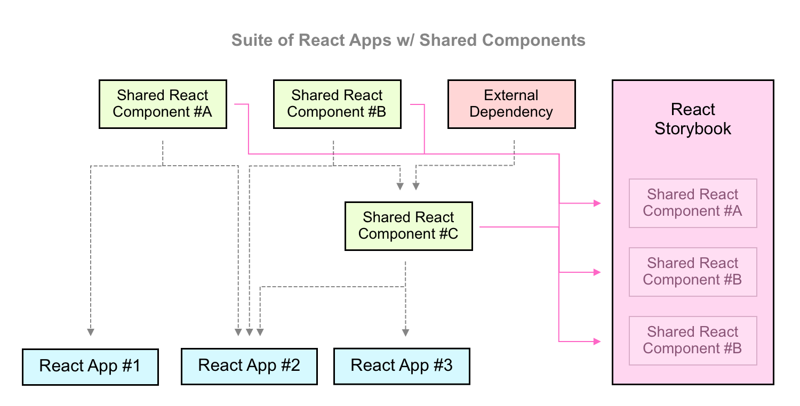](img/0_9YpTKzsnkyYaVcl4.png "Multi React App Monorepo dependency graph")

In this scenario, you would be forced into a process like this:

1. Update the Button code in the Button's git respository.  (`Component #B` in the diagram above)
    1. Create a Pull Requst in the `Component #B` repo and get the new code into `master`.
    2. Publish the `Component #B` Button code on a public or private NPM service.
2. Go into React `Component #C` repo that uses the Button and update the `package.json` dependancies.
    1. Create a second Pull Request in the `Component #C`, repo and get that new code into `master`.
    2. Publish the component to the NPM repo.
3. Go into `React App #1`
    1. Update the dependencies.
    2. Republish the package on npm service.
    3. Submit a new PR.
    4. Deploy
4. Go into act App #2
    1. Update the dependencies.
    2. Republish the package on npm service.
    3. Submit a new PR.
    4. Deploy
5. Go into `React App #3`
    1. Update the dependencies.
    2. Republish the package on npm service.
    3. Submit a new PR.
    4. Deploy

That is five pull requests for a change to one button component!

Clearly this is less than ideal.

## A Simpler Solution

Now imagine using a single repo for the same update. If we use a Monorepo tool like [Lerna], the update process will look more like this:

1. Update the Button code in the Button's git directory.  (`Component #B` in the diagram above)
2. Run `lerna bootstrap` to crosslink the Button `Component #B` into all the sub dependancies.
3. Run `lerna publish` to update the packages in your privite NPM service.
4. Create a Pull Requst in the `Monorepo` repo and get the new code into `master`.
5. Re-deploy the apps with the updated `package.json` version numbers.

Now everything is done in one Pull Request.

This is why large organizations like Facebook and Google make good use of Monorepos. This process can be simplified to use a single shared repo for all the depenencies and apps. The Monorepo scales up without losing as much engineering velocity and reduces human error lost from switching contexual focus.

The following guide will show you how to set up a such Monorepo for a React project.

## Prerequisites

```sh
npm i -g lerna
```

```sh
npm i -g create-react-app
```

Create a directory for your Monorepo project.

```sh
cd ~/repos
mkdir monorepo-react
cd monorepo-react
```

## Setup Lerna 

> **Note:** In order restart these this guide at any time, you remove the following files and directories:
> ## 👇

```sh
sudo rm -r node_modules packages stories .storybook coverage stories
rm package.json package-lock.json setupTests.js lerna.json
```

Create and initialize your [Lerna] monorepo:

```sh
lerna init
```

Your `package.json` should now look like this:

```json
// package.json
{
  "name": "root",
  "private": true,
  "devDependencies": {
    "lerna": "^3.4.3"
  }
}
```

## Install Common Dependencies

Installing these common dependencies will allow you to:

- Run Storybook for the root of your project.
- To have Storybook auto-install the right modules for your React project.
- Have Babel transpile correctly for code, testing and Storybook.

```sh-wrap
npm i -D react react-dom @babel/core@^7.0.0-0 @babel/cli babel-plugin-transform-es2015-modules-commonjs babel-jest enzyme enzyme-adapter-react-16 jest react-test-renderer babel-core@7.0.0-bridge.0 @babel/preset-env @babel/preset-react
```

Your `package.json` should now look like this:

```json
// package.json
{
  "name": "root",
  "private": true,
  "devDependencies": {
    "@babel/cli": "^7.1.2",
    "@babel/core": "^7.1.2",
    "@babel/preset-env": "^7.1.0",
    "@babel/preset-react": "^7.0.0",
    "babel-core": "^7.0.0-bridge.0",
    "babel-jest": "^23.6.0",
    "babel-plugin-transform-es2015-modules-commonjs": "^6.26.2",
    "enzyme": "^3.7.0",
    "enzyme-adapter-react-16": "^1.6.0",
    "jest": "^23.6.0",
    "lerna": "^3.4.3",
    "react": "^16.6.0",
    "react-dom": "^16.6.0",
    "react-test-renderer": "^16.6.0"
  }
}
```

## Install Storybook React

Now we will install and initialize Storybook version 4.

```sh
npx -p @storybook/cli@alpha sb init
```

Note: Installing the `@alpha` version (currently  `@4.0.0-rc.6`), will allow us to set our Babel configuration inside of our `package.json` files which will make configuration easier for sub-packages.

[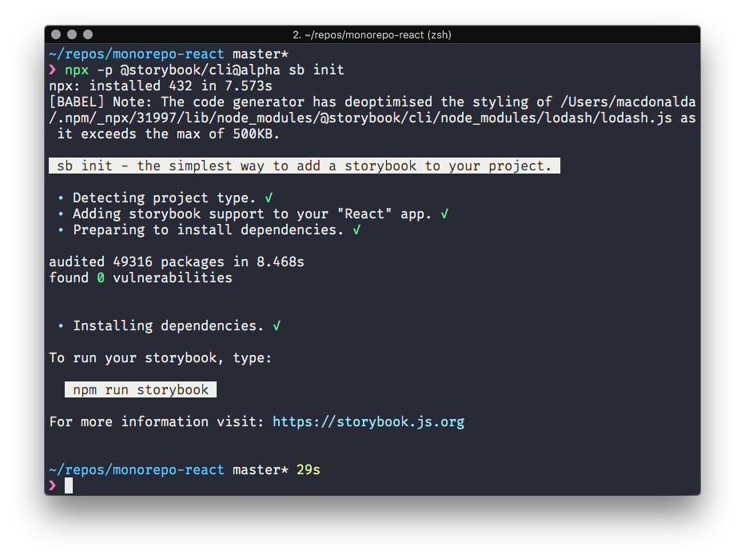](img/Tquu6YT.png "Screenshot of Storybook React 4 installing")

Your root `package.json` file should now look like this:

```json
// package.json
{
  "name": "root",
  "private": true,
  "devDependencies": {
    "@babel/cli": "^7.1.2",
    "@babel/core": "^7.1.2",
    "@babel/preset-env": "^7.1.0",
    "@babel/preset-react": "^7.0.0",
    "babel-core": "^7.0.0-bridge.0",
    "babel-jest": "^23.6.0",
    "babel-plugin-transform-es2015-modules-commonjs": "^6.26.2",
    "enzyme": "^3.7.0",
    "enzyme-adapter-react-16": "^1.6.0",
    "jest": "^23.6.0",
    "lerna": "^3.4.3",
    "react": "^16.6.0",
    "react-dom": "^16.6.0",
    "react-test-renderer": "^16.6.0",
    "@storybook/react": "^4.0.0-alpha.25",
    "@storybook/addon-actions": "^4.0.0-alpha.25",
    "@storybook/addon-links": "^4.0.0-alpha.25",
    "@storybook/addons": "^4.0.0-alpha.25",
    "babel-loader": "^8.0.4"
  },
  "dependencies": {},
  "scripts": {
    "storybook": "start-storybook -p 6006",
    "build-storybook": "build-storybook"
  }
}
```

Now you can test that Storybook runs on your machine.

```sh
npm run storybook
```

[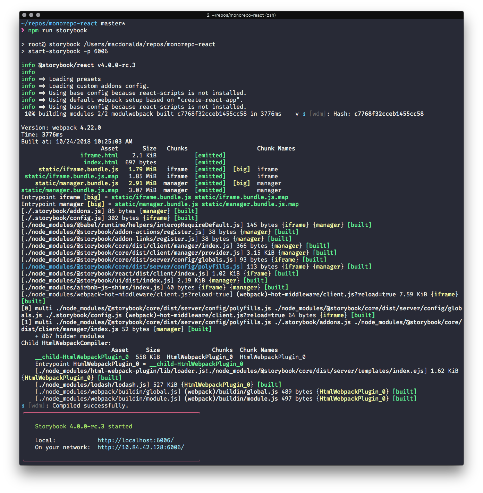](img/gFzGOfJ.png "Screenshot of Storybook React 4 launching from the command line")

Storybook should now launch in your web browser automatically.

[](img/SaYF4x6.png "Screenshot of Storybook running in the web browser")

List the storybook files:

```sh
tree -C .storybook stories
```

- Your `.storybook/` directory contains your Storybook configuration.
- Your `stories/` directory is where your global Storybook stories live.

[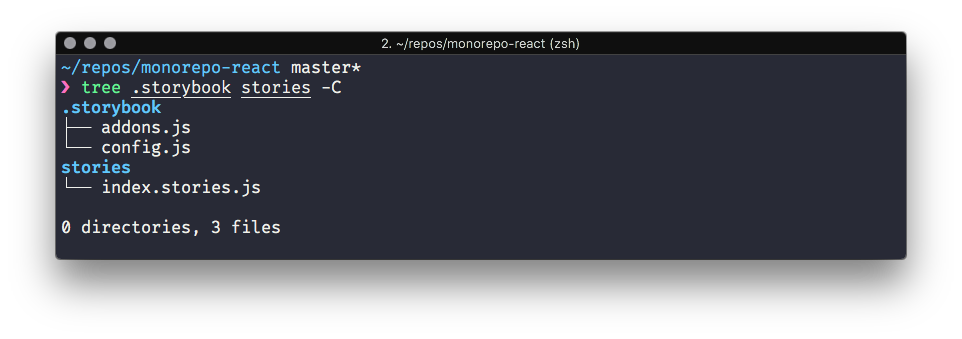](img/m5xzkiZ.png "Screenshot of .storybook and stories directories")

> Note: To install tree: `brew install tree`

## Create Your React App

Create a home in `packages/my-react-app` for your React App.

```sh
cd ~/repos/monorepo-react/packages/
create-react-app my-react-app
```

Run your React app to test things worked.

```sh
cd my-react-app
npm run start
```

You should now see an error message about Webpack like this one:

[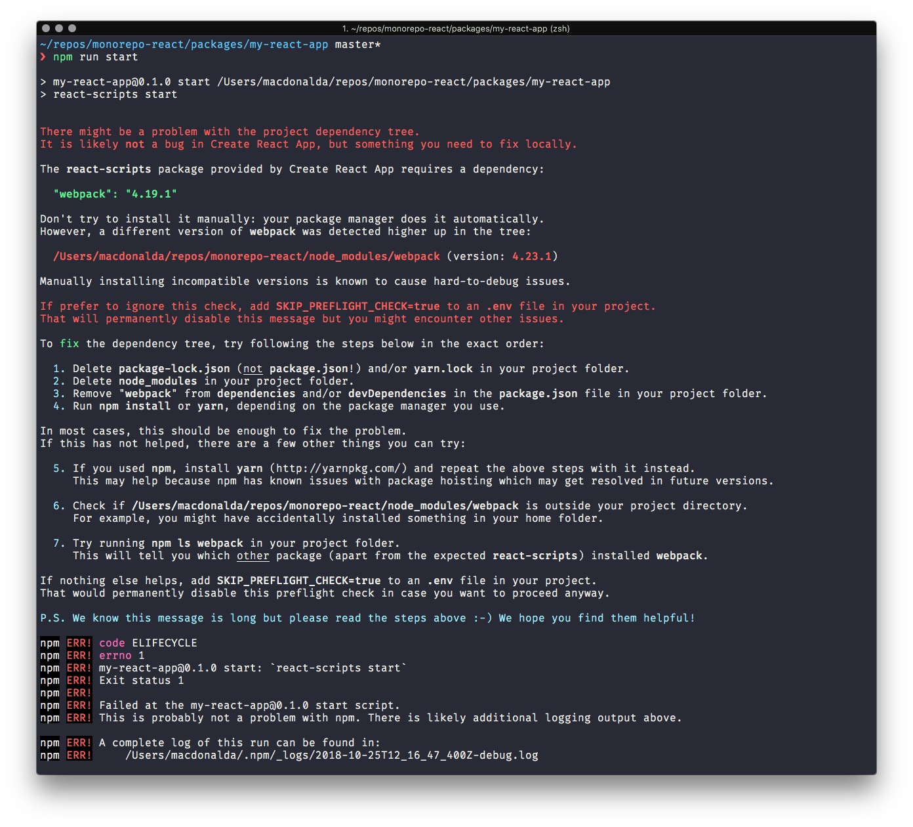](img/5XOdevS.png "Screenshot of React error message about Webpack version number")

We will work around this by setting the `SKIP_PREFLIGHT_CHECK=true` in the `.env` file as suggested.

```sh
echo "SKIP_PREFLIGHT_CHECK=true" > .env
```

You should now be able to run your React app, and your browser should launch automatically.

```sh
npm run start
```

[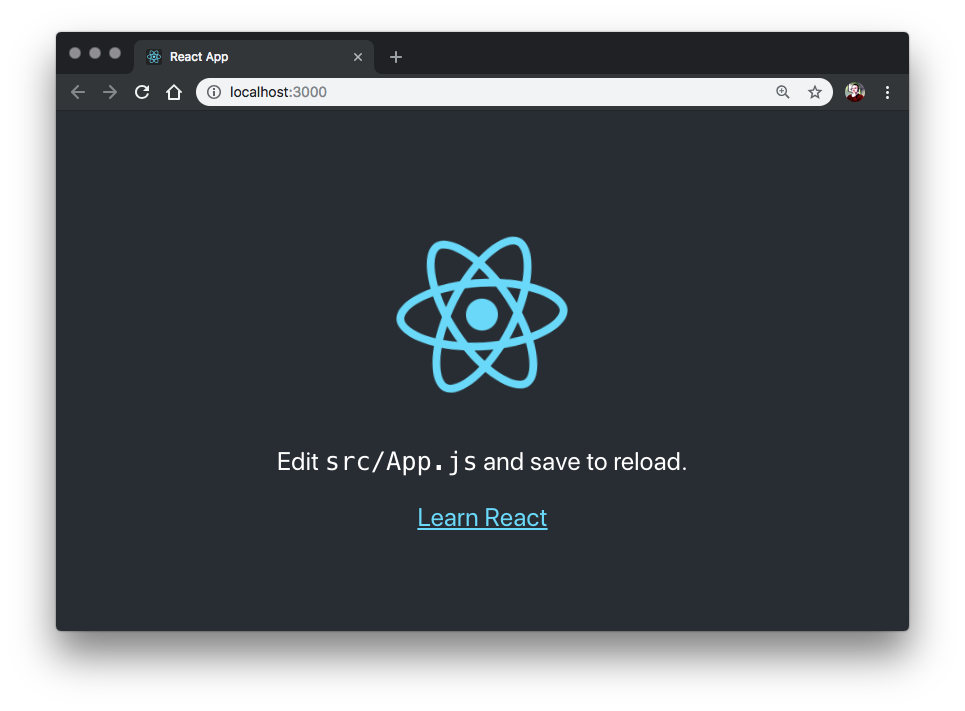](img/yovfAHZ.png "Screenshot of Your React App running in the web browser")

## Create an External React Component

Lets create our first external React component. We will do this inside our `./packages` directory provided by Lerna.

```sh
cd ~/repos/monorepo-react/packages/
mkdir comp-button
cd comp-button
```

Create a `packages/comp-button/package.json` file like this:

```json
// packages/comp-button/package.json
{
  "name": "@project/comp-button",
  "version": "0.1.0",
  "description": "A simple button component",
  "main": "dist/index.js",
  "module": "src/index.js",
  "scripts": {
    "transpile": "babel src -d dist --ignore '**/*.spec.js,**/*.stories.js'",
    "jest": "jest --coverage --verbose --color"
  },
  "babel": {
    "presets": [
      "@babel/preset-env",
      "@babel/preset-react"
    ],
    "env": {
      "test": {
        "plugins": [
          "transform-es2015-modules-commonjs"
        ]
      }
    }
  }
}
```

What is going on in the `package.json` file:

- `name`: The organizational namespace for your component when installed via NPM or cross-linked Lerna.
- `main`: The the compiled code that will be shipped with the build of your React app.
- `module`: The pre-compiled code that will be imported as a local run-time dependency while developing the app or running tests.
- `transpile`: An NPM script start the transpile of your code with Babel. **Note:** We are not using `build` because we want to reserve this word later to build our React apps with `lerna run build`.
- `babel`: This setup configures our component to transpile with Babel 7 for React.

> Note: Because we installed components like `react`, `react-dom`, `@babel/core@^7.0.0-0` in our root `package.json` we do not have to install them again in this package.

Make a source directory for your React component.

```sh
mkdir src
cd src
```

Create your React component in `packages/comp-button/index.js`:

```jsx
// packages/comp-button/index.js
import React from 'react'

const Button = ({ type = 'button', children, onClick }) => (
    <div>
      <button type={type} className="button" onClick={onClick}>
        {children}
      </button>
  </div>
)

export default Button
```

## Transpile Your Component

Now lets try to transpile your React code to ECMAScript 2015 (JavaScript with support for older browsers).

```sh
lerna run transpile
```

You should see the following output:

[](img/YDkWQ3T.png "Screenshot of babel transpiling button component")

Your `./dist/` directory should now contain the transpiled `index.js` file:

```sh
tree -C ../dist
```


The `./dist/index.js` file should contain your transpiled code, like this:

```js
// ./dist/index.js
"use strict";

Object.defineProperty(exports, "__esModule", {
  value: true
});
exports.default = void 0;

var _react = _interopRequireDefault(require("react"));

function _interopRequireDefault(obj) { return obj && obj.__esModule ? obj : { default: obj }; }

var Button = function Button(_ref) {
  var _ref$type = _ref.type,
      type = _ref$type === void 0 ? 'button' : _ref$type,
      children = _ref.children,
      onClick = _ref.onClick;
  return _react.default.createElement("div", null, _react.default.createElement("button", {
    type: type,
    className: "button",
    onClick: onClick
  }, children));
};

var _default = Button;
exports.default = _default;
```

## Test Your Component

While we are here, lets create a Jest spec for your component in `packages/comp-button/src/index.spec.js`:

```jsx
// packages/comp-button/src/index.spec.js
import React from 'react';
import {mount} from 'enzyme';
import Button from '.';

describe('Button Component', function() {
  it('renders without props', function() {
    const wrapper = mount(<Button />);
    const button = wrapper.find('.button');
    expect(button.length).toBe(1);
  })

  it('renders without props', function() {
    const wrapper = mount(<Button />);
    const button = wrapper.find('.button');
    expect(button.length).toBe(1);
  })

  it('renders children when passed in', () => {
    const wrapper = mount(
      <Button>
        <p className="child">Some Child</p>
      </Button>
    );

    const child = wrapper.find('.child')
    expect(child.length).toBe(1)
  })

  it('handles onClick events', () => {
    const onClick = jest.fn()
    const wrapper = mount(
      <Button onClick={onClick} />
    )

    wrapper.find('button').simulate('click')

    expect(onClick.mock.calls.length).toBe(1)
  })
})
```

> **Note:** we installed `babel-core@7.0.0-bridge.0` and `babel-jest` earlier to make Babel 7 code compatible with Jest. (See: [Install Common Dependencies](install-common-depenencies))

Add the following "jest" section to your root `package.json`:

```json
// package.json
  "jest": {
    "setupFiles": [
      "../../setupTests"
    ]
  }
```

Your `packages/comp-button/package.json` should now look like this:

```json
// packages/comp-button/package.json
{
    "name": "@my-project/comp-button",
    "version": "0.1.0",
    "description": "A simple button component",
    "main": "dist/index.js",
    "module": "src/index.js",
    "scripts": {
    "transpile": "babel src -d dist --ignore '**/*.spec.js,**/*.stories.js'",
      "jest": "jest --coverage --verbose --color"
    },
    "babel": {
      "presets": [
        "@babel/preset-env",
        "@babel/preset-react"
      ],
      "env": {
        "test": {
          "plugins": [
            "transform-es2015-modules-commonjs"
          ]
        }
      }
    },
    "jest": {
      "setupFiles": [
        "../../setupTests"
      ]
    }
  }
```

When Jest runs, `../../setupTests` file will reference `setupTests.js` in your Monorepo root.

Let's add this `setupTests.js` file with some Enzyme helpers:

```js
// setupTests.js
const enzyme = require('enzyme');
const Adapter = require('enzyme-adapter-react-16');
enzyme.configure({ adapter: new Adapter() });
```

> **Note:** we deliberately use the older require syntax here, so that `setupTests.js` is loadable without additional Babel configuration.

Now lets run Jest to see the spec working:

```sh
lerna run jest
```

> **Note:** We are using `jest` and not `test` to reserve the word "test" for running all tests, including End to End, linting, etc.

[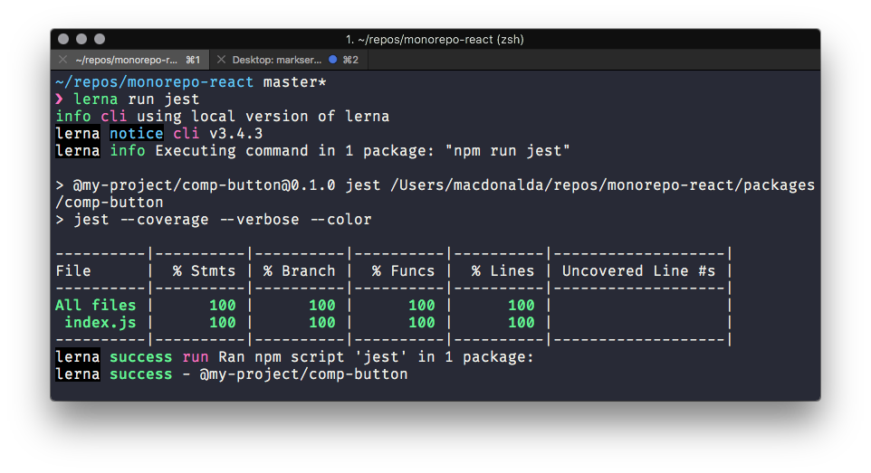](img/zIzdDfH.png "Screenshot of Jest React Test passing with Babel 7")

## Add a Story for Your React Component

Now lets create a Storybook story for our new Button component:

Add the following code to `index.stories.js`:

```jsx
// index.stories.js
import React from 'react'
import { storiesOf } from '@storybook/react'
import { action } from '@storybook/addon-actions'

import Button from '.'

storiesOf('Button', module)

  .add('with text', () => (
      <Button onClick={action('clicked')}>Button</Button>
  ))

  .add('with some emoji', () => (
      <Button onClick={action('clicked')}>😀 😎 👍 💯</Button>
  ))

  .add('with a theme provider', () => (
    <Button onClick={action('clicked')}>Button</Button>
  ))
```

### Reconfigure Storybook

We will now need to configure Storybook to load stories from all the `packages/**` directories, instead of loading `stories/` from your Monorepo root.

Edit your Storybook configuration in `~/repos/monorepo-react/.storybook/config.js`, so it look like this:

```js
// .storybook/config.js
import { configure } from '@storybook/react';

// automatically import all files ending in *.stories.js
const req = require.context('../packages', true, /.stories.js$/);
function loadStories() {
  req.keys().forEach(filename => req(filename));
}

configure(loadStories, module);
```

It's now safe to delete the `stories/` directory at the Monorepo root.

```sh
cd ~/repos/monorepo-react/
sudo rm -r stories
```

Lets check that the Storybook still loads with your `comp-button` Story:

```sh
npm run storybook
```

You should now be able to see your button component Story which was built from your `packages/comp-button` directory:

[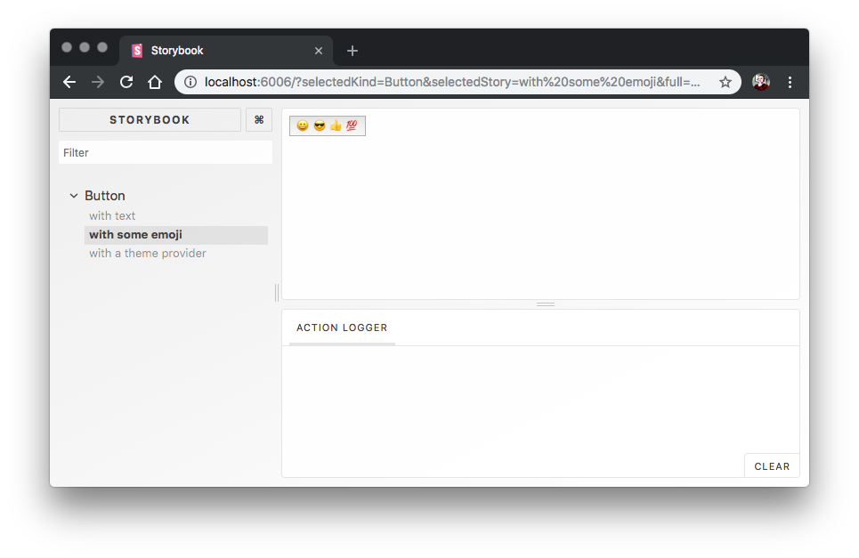](img/YLqC2Fi.png "Screenshot of Storybook displaying your Button component Story")

## Crosslink Your Dependencies with Lerna

Add the following dependency to your `packages/my-react-app/package.json`:

```json
// packages/my-react-app/package.json
{
  "dependencies": {
    "@my-project/comp-button": "*"
  }
}
```

Your `packages/my-react-app/package.json` should now look like this:

```json
// packages/my-react-app/package.json
{
  "name": "@my-project/my-react-app",
  "version": "0.1.0",
  "private": true,
  "dependencies": {
    "react": "^16.6.0",
    "react-dom": "^16.6.0",
    "react-scripts": "2.0.5",
    "@my-project/comp-button": "*"
  },
  "scripts": {
    "start": "react-scripts start",
    "build": "react-scripts build",
    "test": "react-scripts test",
    "eject": "react-scripts eject"
  },
  "eslintConfig": {
    "extends": "react-app"
  },
  "browserslist": [
    ">0.2%",
    "not dead",
    "not ie <= 11",
    "not op_mini all"
  ]
}
```

We can now cross-link our packages using `lerna bootstrap`.

```sh
lerna bootstrap
```

You should see the following success message:

[](img/XZzyCaw.png "Screenshot of the Lerna Bootstrap success message")

# Use Your Component in The React App

Add the follow lines to `packages/my-react-app/src/App.js`:

```jsx
// packages/my-react-app/src/App.js
import CompButton from '@my-project/comp-button';
<CompButton>Foobar!</CompButton>
```

Your file will now look like this:

```jsx
// packages/my-react-app/src/App.js
import React, { Component } from 'react';
import logo from './logo.svg';
import './App.css';
import CompButton from '@my-project/comp-button';

class App extends Component {
  render() {
    return (
      <div className="App">
        <header className="App-header">
          
          <p>
            Edit <code>src/App.js</code> and save to reload.
          </p>
          <a
            className="App-link"
            href="https://reactjs.org"
            target="_blank"
            rel="noopener noreferrer"
          >
            Learn React
          </a>
          <CompButton>Foobar!</CompButton>
        </header>
      </div>
    );
  }
}

export default App;
```

Now start your app:

```sh
npm run start
```

You should see the following error:

[](img/LfNmtHp.png "Screenshot of React Start error")

The React App is failing to compile because Create-React-App's Webpack config is unaware of the any external modules. This means Webpack can not tell Babel-Loader about your component directories, and the sources do not get transpiled.

It seems like this will problem may go away with future versions of Create-React-App, although this may require Yarn Workspaces. So make sure you check the GitHub Issue [Create-React-App-Lerna-Support] to see if this feature os landed before using the following work-around.

## Rewire Your React App for Lerna

I created a small Work-around Node Module to override Create-React-App Webpack configs inside Lerna projects, called [Babel-Loader-Lerna-CRA]. It's pretty simple. It just updates the Webpack paths for Babel-Loader.

You can install this package using NPM:

```sh
npm i -D babel-loader-lerna-cra
```

Now lets update the `package.json` in our Lerna root with glob patterns that describe the relationship between our components and our app.

```json
// package.json
"babel-loader-lerna-cra": {
  "imports": "packages/comp-*/src",
  "apps":  "packages/*react-app*"
}
```

Your `package.json` should now look like this:

```json
// package.json
{
  "name": "root",
  "private": true,
  "devDependencies": {
    "@babel/cli": "^7.1.2",
    "@babel/core": "^7.1.2",
    "@babel/preset-env": "^7.1.0",
    "@babel/preset-react": "^7.0.0",
    "@storybook/addon-actions": "^4.0.0-alpha.25",
    "@storybook/addon-links": "^4.0.0-alpha.25",
    "@storybook/addons": "^4.0.0-alpha.25",
    "@storybook/react": "^4.0.0-alpha.25",
    "babel-core": "^7.0.0-bridge.0",
    "babel-jest": "^23.6.0",
    "babel-loader": "^8.0.4",
    "babel-loader-lerna-cra": "^0.1.2",
    "babel-plugin-transform-es2015-modules-commonjs": "^6.26.2",
    "enzyme": "^3.7.0",
    "enzyme-adapter-react-16": "^1.6.0",
    "jest": "^23.6.0",
    "lerna": "^3.4.3",
    "react": "^16.6.0",
    "react-dom": "^16.6.0",
    "react-test-renderer": "^16.6.0"
  },
  "dependencies": {},
  "scripts": {
    "storybook": "start-storybook -p 6006",
    "build-storybook": "build-storybook"
  },
  "babel-loader-lerna-cra": {
    "imports": "packages/comp-*/src",
    "apps":  "packages/*react-app*"
  }
}
```

- The `imports` refer to components that the React app will neeed to transpile.
- The `apps` inform `babel-loader-lerna-cra` where the Webpack overrides will need to happen.

Now lets bootstrap the Webpack configs in our React app with `babel-loader-lerna-cra`:

```sh
npx babel-loader-lerna-cra
```

You should see the following output:

[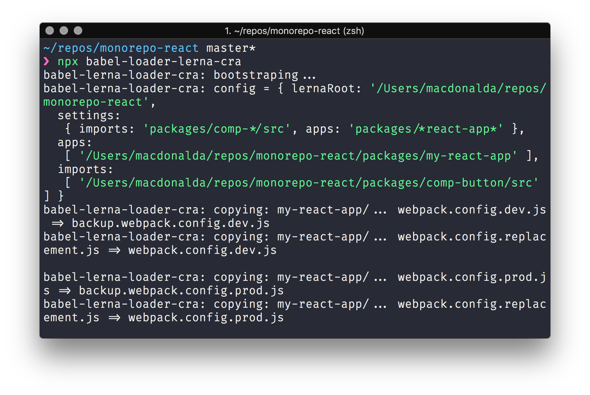](img/zpGHfZY.png "Screenshot of babel-loader-lerna-cra bootstrapping Create-React-App's Webpack config in the CLI")

Now lets try running your React App again:

```sh
cd ~/repos/monorepo-react/packages/my-react-app
npm run start
```

You should now see the React App launch in a browser with your `CompButton` component rendering with the text "Foorbar!"

[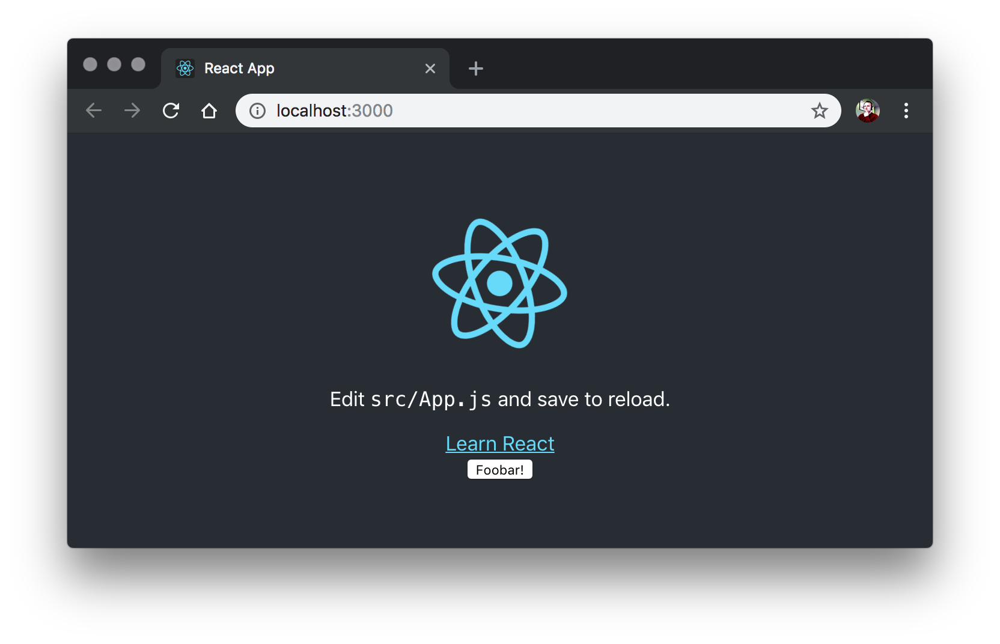](img/gBfC9IH.png "Screenshot of the React app running with a Lerna sibling component")

## So what did we get out of this work-around?

- **Auto Transpilation of Lerna Siblings**

  Our React App can now import sibling Lerna depedencies and transpile then when needed.

- **React App Hot Reloading**
  
  When we change our React component file, will hot-update the app without having to add any global watchers to the Lerna project to kick of a transpile.

  Here is our `CompButton` component being Hot-Reloaded as it is being updated:

  [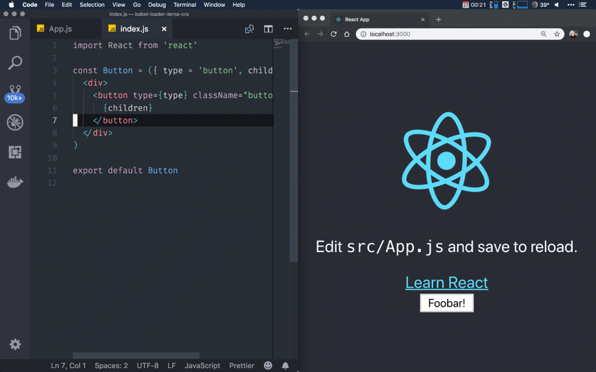](img/ukPvQbS.gif "Five second animated screencast of Hot Reloading using babel-loeader-lerna-cra")

- **Storybook Hot Reloading**
  
  Nothing special here, but it's worth noting that our Storybook still hot-reloads too.

  [](img/qrtY6qd.png "Screenshot of Storybook after hot-reloading our Button component")

# Conclusion

I think this is as far as I would like to take this in a single article. I hope someone else finds this setup useful. If people express interest, I will follow up with a Part 2 on how to setup CI to ship multiple React Apps from this Monorepo setup.

Comments, feedback, suggestions always welcome!

Always ready to learn.

# Interesting Articles on This Topic:

- [Building Large Scale React Applications in a Monorepo](https://medium.com/@luisvieira_gmr/building-large-scale-react-applications-in-a-monorepo-91cd4637c131)
- [Why Google Stores Billions of Lines of Code in a Single Repository](https://cacm.acm.org/magazines/2016/7/204032-why-google-stores-billions-of-lines-of-code-in-a-single-repository/fulltext)
- [GitHub: Support Lerna and/or Yarn Workspaces](https://cacm.acm.org/magazines/2016/7/204032-why-google-stores-billions-of-lines-of-code-in-a-single-repository/fulltext)
- [GitHub: Add support for yarn and lerna monorepos.](https://cacm.acm.org/magazines/2016/7/204032-why-google-stores-billions-of-lines-of-code-in-a-single-repository/fulltext)
- [Customize Create React App without Ejecting](https://cacm.acm.org/magazines/2016/7/204032-why-google-stores-billions-of-lines-of-code-in-a-single-repository/fulltext)


[Lerna]: https://lernajs.io/ "Lerna"
[Create-React-App-2]: https://github.com/facebook/create-react-app "Create React App"
[Jest]: https://jestjs.io/ "Jest"
[Storybook-4-React]: https://github.com/storybooks/storybook/tree/master/app/react "Storybook React"
[Create-React-App-Lerna-Support]: https://github.com/facebook/create-react-app/issues/1333 "Create-React-App Lerna Support"
[Babel-Loader-Lerna-CRA]: https://www.npmjs.com/package/babel-loader-lerna-cra "Babel-Loader Lerna CRA"