[Storybook.js](https://storybook.js.org/) comes with many great starters for tools, like [Svelte](https://svelte.dev), [React](https://react.dev/) and [Angular](https://angular.dev/). But how can we use Storybook with Vanilla Web Components?

By "Vanilla Web Components", I mean: using Web Components without a framework, such as the [Lit Framework](https://lit.dev/). Currently when using [@storybook/web-components](https://www.npmjs.com/package/@storybook/web-components), Storybook makes the assumption that you want to use the Lit framework. 🤦‍♂️

## TLDR

> In this tutorial you will learn how to set up Storybook.js without a JavaScript framework.

1. [Source Code on GitHub](https://github.com/F1LT3R/storybook-html-vite-vanilla-web-components)
2. [CodeSandbox Demo](https://codesandbox.io/p/github/F1LT3R/storybook-html-vite-vanilla-web-components/main?layout=%257B%2522sidebarPanel%2522%253A%2522EXPLORER%2522%252C%2522rootPanelGroup%2522%253A%257B%2522direction%2522%253A%2522horizontal%2522%252C%2522contentType%2522%253A%2522UNKNOWN%2522%252C%2522type%2522%253A%2522PANEL_GROUP%2522%252C%2522id%2522%253A%2522ROOT_LAYOUT%2522%252C%2522panels%2522%253A%255B%257B%2522type%2522%253A%2522PANEL_GROUP%2522%252C%2522contentType%2522%253A%2522UNKNOWN%2522%252C%2522direction%2522%253A%2522vertical%2522%252C%2522id%2522%253A%2522clsc5z8kc0006356am813qnzl%2522%252C%2522sizes%2522%253A%255B76.84292379471229%252C23.15707620528771%255D%252C%2522panels%2522%253A%255B%257B%2522type%2522%253A%2522PANEL_GROUP%2522%252C%2522contentType%2522%253A%2522EDITOR%2522%252C%2522direction%2522%253A%2522horizontal%2522%252C%2522id%2522%253A%2522EDITOR%2522%252C%2522panels%2522%253A%255B%257B%2522type%2522%253A%2522PANEL%2522%252C%2522contentType%2522%253A%2522EDITOR%2522%252C%2522id%2522%253A%2522clsc5z8kc0002356aoknr0xw0%2522%257D%255D%257D%252C%257B%2522type%2522%253A%2522PANEL_GROUP%2522%252C%2522contentType%2522%253A%2522SHELLS%2522%252C%2522direction%2522%253A%2522horizontal%2522%252C%2522id%2522%253A%2522SHELLS%2522%252C%2522panels%2522%253A%255B%257B%2522type%2522%253A%2522PANEL%2522%252C%2522contentType%2522%253A%2522SHELLS%2522%252C%2522id%2522%253A%2522clsc5z8kc0004356af36rsttn%2522%257D%255D%252C%2522sizes%2522%253A%255B100%255D%257D%255D%257D%252C%257B%2522type%2522%253A%2522PANEL_GROUP%2522%252C%2522contentType%2522%253A%2522DEVTOOLS%2522%252C%2522direction%2522%253A%2522vertical%2522%252C%2522id%2522%253A%2522DEVTOOLS%2522%252C%2522panels%2522%253A%255B%257B%2522type%2522%253A%2522PANEL%2522%252C%2522contentType%2522%253A%2522DEVTOOLS%2522%252C%2522id%2522%253A%2522clsc5z8kc0005356an4s3srye%2522%257D%255D%252C%2522sizes%2522%253A%255B100%255D%257D%255D%252C%2522sizes%2522%253A%255B45.279422189014696%252C54.720577810985304%255D%257D%252C%2522tabbedPanels%2522%253A%257B%2522clsc5z8kc0002356aoknr0xw0%2522%253A%257B%2522id%2522%253A%2522clsc5z8kc0002356aoknr0xw0%2522%252C%2522activeTabId%2522%253A%2522clsj6qnds00o5356iyxqfc317%2522%252C%2522tabs%2522%253A%255B%257B%2522id%2522%253A%2522clsc6skz40002356atw36aphx%2522%252C%2522mode%2522%253A%2522permanent%2522%252C%2522type%2522%253A%2522FILE%2522%252C%2522initialSelections%2522%253A%255B%257B%2522startLineNumber%2522%253A21%252C%2522startColumn%2522%253A1%252C%2522endLineNumber%2522%253A21%252C%2522endColumn%2522%253A1%257D%255D%252C%2522filepath%2522%253A%2522%252Fstories%252FCounter.vite.stories.js%2522%252C%2522state%2522%253A%2522IDLE%2522%257D%252C%257B%2522type%2522%253A%2522FILE%2522%252C%2522filepath%2522%253A%2522%252F.codesandbox%252Ftasks.json%2522%252C%2522id%2522%253A%2522clsj6qnds00o5356iyxqfc317%2522%252C%2522mode%2522%253A%2522permanent%2522%257D%255D%257D%252C%2522clsc5z8kc0005356an4s3srye%2522%253A%257B%2522id%2522%253A%2522clsc5z8kc0005356an4s3srye%2522%252C%2522tabs%2522%253A%255B%257B%2522type%2522%253A%2522TASK_PORT%2522%252C%2522port%2522%253A6006%252C%2522taskId%2522%253A%2522dev%2522%252C%2522id%2522%253A%2522clsda1nt9003h356h0o731vu8%2522%252C%2522mode%2522%253A%2522permanent%2522%252C%2522path%2522%253A%2522%252F%253Fpath%253D%252Fdocs%252Fconfigure-your-project--docs%2522%257D%255D%252C%2522activeTabId%2522%253A%2522clsda1nt9003h356h0o731vu8%2522%257D%252C%2522clsc5z8kc0004356af36rsttn%2522%253A%257B%2522id%2522%253A%2522clsc5z8kc0004356af36rsttn%2522%252C%2522activeTabId%2522%253A%2522clsj5k6sw0019356i6cfn94eq%2522%252C%2522tabs%2522%253A%255B%257B%2522type%2522%253A%2522TASK_LOG%2522%252C%2522taskId%2522%253A%2522dev%2522%252C%2522id%2522%253A%2522clsj5k6sw0019356i6cfn94eq%2522%252C%2522mode%2522%253A%2522permanent%2522%257D%255D%257D%257D%252C%2522showDevtools%2522%253Atrue%252C%2522showShells%2522%253Atrue%252C%2522showSidebar%2522%253Atrue%252C%2522sidebarPanelSize%2522%253A15%257D).

[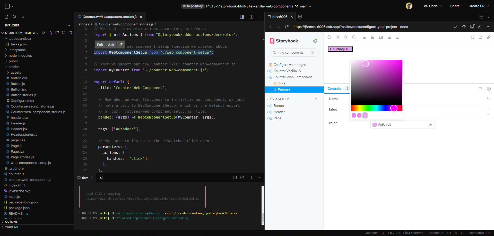](https://codesandbox.io/p/github/F1LT3R/storybook-html-vite-vanilla-web-components/main?layout=%257B%2522sidebarPanel%2522%253A%2522EXPLORER%2522%252C%2522rootPanelGroup%2522%253A%257B%2522direction%2522%253A%2522horizontal%2522%252C%2522contentType%2522%253A%2522UNKNOWN%2522%252C%2522type%2522%253A%2522PANEL_GROUP%2522%252C%2522id%2522%253A%2522ROOT_LAYOUT%2522%252C%2522panels%2522%253A%255B%257B%2522type%2522%253A%2522PANEL_GROUP%2522%252C%2522contentType%2522%253A%2522UNKNOWN%2522%252C%2522direction%2522%253A%2522vertical%2522%252C%2522id%2522%253A%2522clsc5z8kc0006356am813qnzl%2522%252C%2522sizes%2522%253A%255B76.84292379471229%252C23.15707620528771%255D%252C%2522panels%2522%253A%255B%257B%2522type%2522%253A%2522PANEL_GROUP%2522%252C%2522contentType%2522%253A%2522EDITOR%2522%252C%2522direction%2522%253A%2522horizontal%2522%252C%2522id%2522%253A%2522EDITOR%2522%252C%2522panels%2522%253A%255B%257B%2522type%2522%253A%2522PANEL%2522%252C%2522contentType%2522%253A%2522EDITOR%2522%252C%2522id%2522%253A%2522clsc5z8kc0002356aoknr0xw0%2522%257D%255D%257D%252C%257B%2522type%2522%253A%2522PANEL_GROUP%2522%252C%2522contentType%2522%253A%2522SHELLS%2522%252C%2522direction%2522%253A%2522horizontal%2522%252C%2522id%2522%253A%2522SHELLS%2522%252C%2522panels%2522%253A%255B%257B%2522type%2522%253A%2522PANEL%2522%252C%2522contentType%2522%253A%2522SHELLS%2522%252C%2522id%2522%253A%2522clsc5z8kc0004356af36rsttn%2522%257D%255D%252C%2522sizes%2522%253A%255B100%255D%257D%255D%257D%252C%257B%2522type%2522%253A%2522PANEL_GROUP%2522%252C%2522contentType%2522%253A%2522DEVTOOLS%2522%252C%2522direction%2522%253A%2522vertical%2522%252C%2522id%2522%253A%2522DEVTOOLS%2522%252C%2522panels%2522%253A%255B%257B%2522type%2522%253A%2522PANEL%2522%252C%2522contentType%2522%253A%2522DEVTOOLS%2522%252C%2522id%2522%253A%2522clsc5z8kc0005356an4s3srye%2522%257D%255D%252C%2522sizes%2522%253A%255B100%255D%257D%255D%252C%2522sizes%2522%253A%255B45.279422189014696%252C54.720577810985304%255D%257D%252C%2522tabbedPanels%2522%253A%257B%2522clsc5z8kc0002356aoknr0xw0%2522%253A%257B%2522id%2522%253A%2522clsc5z8kc0002356aoknr0xw0%2522%252C%2522activeTabId%2522%253A%2522clsj6qnds00o5356iyxqfc317%2522%252C%2522tabs%2522%253A%255B%257B%2522id%2522%253A%2522clsc6skz40002356atw36aphx%2522%252C%2522mode%2522%253A%2522permanent%2522%252C%2522type%2522%253A%2522FILE%2522%252C%2522initialSelections%2522%253A%255B%257B%2522startLineNumber%2522%253A21%252C%2522startColumn%2522%253A1%252C%2522endLineNumber%2522%253A21%252C%2522endColumn%2522%253A1%257D%255D%252C%2522filepath%2522%253A%2522%252Fstories%252FCounter.vite.stories.js%2522%252C%2522state%2522%253A%2522IDLE%2522%257D%252C%257B%2522type%2522%253A%2522FILE%2522%252C%2522filepath%2522%253A%2522%252F.codesandbox%252Ftasks.json%2522%252C%2522id%2522%253A%2522clsj6qnds00o5356iyxqfc317%2522%252C%2522mode%2522%253A%2522permanent%2522%257D%255D%257D%252C%2522clsc5z8kc0005356an4s3srye%2522%253A%257B%2522id%2522%253A%2522clsc5z8kc0005356an4s3srye%2522%252C%2522tabs%2522%253A%255B%257B%2522type%2522%253A%2522TASK_PORT%2522%252C%2522port%2522%253A6006%252C%2522taskId%2522%253A%2522dev%2522%252C%2522id%2522%253A%2522clsda1nt9003h356h0o731vu8%2522%252C%2522mode%2522%253A%2522permanent%2522%252C%2522path%2522%253A%2522%252F%253Fpath%253D%252Fdocs%252Fconfigure-your-project--docs%2522%257D%255D%252C%2522activeTabId%2522%253A%2522clsda1nt9003h356h0o731vu8%2522%257D%252C%2522clsc5z8kc0004356af36rsttn%2522%253A%257B%2522id%2522%253A%2522clsc5z8kc0004356af36rsttn%2522%252C%2522activeTabId%2522%253A%2522clsj5k6sw0019356i6cfn94eq%2522%252C%2522tabs%2522%253A%255B%257B%2522type%2522%253A%2522TASK_LOG%2522%252C%2522taskId%2522%253A%2522dev%2522%252C%2522id%2522%253A%2522clsj5k6sw0019356i6cfn94eq%2522%252C%2522mode%2522%253A%2522permanent%2522%257D%255D%257D%257D%252C%2522showDevtools%2522%253Atrue%252C%2522showShells%2522%253Atrue%252C%2522showSidebar%2522%253Atrue%252C%2522sidebarPanelSize%2522%253A15%257D)

## Setting Up Vite

The easiest way to serve our components to Storybook.js, is to use [Vite](https://vitejs.dev/). Vite is an HTML server, a JavaScript bundler, and comes with Hot Module Reloading. You can think of Vite as playing a similar role to how [WebPack](https://webpack.js.org/) is used for React.

Vite ships with a [template](https://github.com/vitejs/vite/tree/main/packages/create-vite) called `vanilla`, for a vanilla JavaScript setup. Let's use the vanilla template to setup our Vite app.

```cli
npm create vite@latest my-vanilla-app -- --template vanilla

# OUTPUT
# Need to install the following packages:
# create-vite@5.2.0
# Ok to proceed? (y) y
# 
# Scaffolding project in /home/user/repos/vite-storybooks/my-vanilla-app...
# 
# Done. Now run:
# 
#   cd my-vanilla-app
#   npm install
#   npm run dev
```

Lets run the `my-vanilla-app` project.

```cli
cd my-vanilla-app

npm install

# OUTPUT
# added 11 packages, and audited 12 packages in 2s
# 
# 3 packages are looking for funding
#   run `npm fund` for details
# 
# found 0 vulnerabilities

npm run dev

# OUTPUT
# 
# > my-vanilla-app@0.0.0 dev
# > vite
# 
# 
#   VITE v5.1.0  ready in 93 ms
# 
#   ➜  Local:   http://localhost:5173/
#   ➜  Network: use --host to expose
#   ➜  press h + enter to show help
```

Clicking the `http://localhost:5173` link in the terminal, should launch your vanilla Vite app in the web browser. You should see a little counter button that increments when you click it.

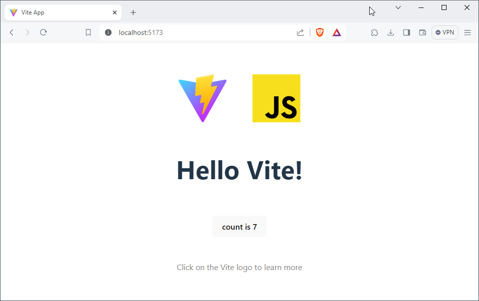

## How Does Vanilla Vite Work?

Before we try to add Web Components, lets take a look at how Vite initializes a component and renders it in the page. Understanding how vanilla Vite works, will give us the information on how to connect our components with Storybook. 

Our current `package.json` file looks sparse. Our only dependency is `vite` itself.

```json
// package.json
{
  "name": "my-vanilla-app",
  "private": true,
  "version": "0.0.0",
  "type": "module",
  "scripts": {
    "dev": "vite",
    "build": "vite build",
    "preview": "vite preview"
  },
  "devDependencies": {
    "vite": "^5.1.0"
  }
}
```

Looking at our vanilla Counter component we can see that `setupCounter` function acts like a constructor, and works on an HTML DOM element that is passed in as the parameter `element`. The events are attached and the changes are handled without passing anything back to the caller.

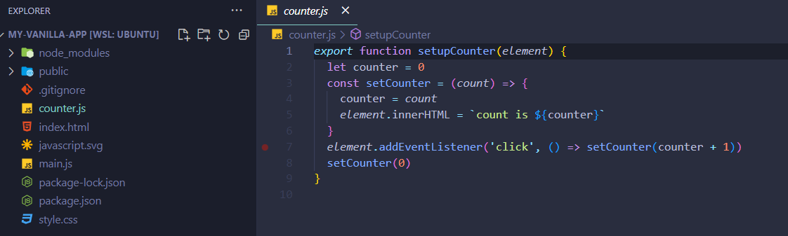

1. The `counter.js`  file is imported at the top of `main.js`.
2. The constructor function is called against an HTML DOM element.
3. The DOM element for `#counter` is selected from the app's HTML template.

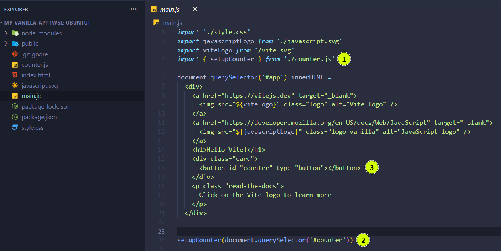

## Adding Storybook to The Vite App

Now we need to add Storybook.js to our project. Instead of Storybook guessing what type of project we are using, we will tell it explicitly using `--type html`.

```sh
npx sb init --type html

# OUTPUT
# ╭───────────────────────────────────────────────────────╮
# │                                                       │
# │   Adding Storybook version 7.6.13 to your project..   │
# │                                                       │
# ╰───────────────────────────────────────────────────────╯
#  • Installing Storybook for user specified project type: html. ✓
#  • Preparing to install dependencies. ✓
# 
# 
#  • Installing dependencies
# 
# removed 954 packages, and audited 14 packages in 689ms
# 
# 3 packages are looking for funding
#   run `npm fund` for details
# 
# found 0 vulnerabilities
# . ✓
#  • Adding Storybook support to your "HTML" app • Detected Vite project. Setting builder to Vite. ✓
# 
#   ✔ Getting the correct version of 10 packages
#   ✔ Installing Storybook dependencies
# . ✓
#  • Preparing to install dependencies. ✓
# 
# 
#  • Installing dependencies
# 
# up to date, audited 968 packages in 978ms
# 
# 182 packages are looking for funding
#   run `npm fund` for details
# 
# found 0 vulnerabilities
# . ✓
# ╭──────────────────────────────────────────────────────────────────────────────╮
# │                                                                              │
# │   Storybook was successfully installed in your project! 🎉                   │
# │   To run Storybook manually, run npm run storybook. CTRL+C to stop.          │
# │                                                                              │
# │   Wanna know more about Storybook? Check out https://storybook.js.org/       │
# │   Having trouble or want to chat? Join us at https://discord.gg/storybook/   │
# │                                                                              │
# ╰──────────────────────────────────────────────────────────────────────────────╯
# 
# Running Storybook
# 
# > my-vanilla-app@0.0.0 storybook
# > storybook dev -p 6006 --quiet
# 
# @storybook/cli v7.6.13
# 
# (node:376221) [DEP0040] DeprecationWarning: The `punycode` module is deprecated. Please use a userland alternative instead.
# (Use `node --trace-deprecation ...` to show where the warning was created)
# info => Starting manager..
# info => Starting preview..
```

Once this process if complete, the browser will be launched, where you should see Storybook loaded from `http://localhost:6006/`.


Your `package.json` file should now reflect the changes that Storybook made. You will see that `storybook` and `@storybook/plugin-name` added to your `devDependencies`.

Notice that `@storybook/html-vite` was added to your `package.json`. This links your Vite configuration with your Vanilla JavaScript app. Vite and Storybook both think of a Vanilla JavaScript app, as: "HTML". 🙃

You will also see `react` and `react-dom` in the `devDependencies` of your `package.json`. This is because Storybook itself is developed with React.

Finally, you will notice there are new `scripts` for storybook. For example: you can use `npm run storybook` to launch Storybook from the CLI.

```json
// package.json
{
  "name": "my-vanilla-app",
  "private": true,
  "version": "0.0.0",
  "type": "module",
  "scripts": {
    "dev": "vite",
    "build": "vite build",
    "preview": "vite preview",
    "storybook": "storybook dev -p 6006",
    "build-storybook": "storybook build"
  },
  "devDependencies": {
    "@storybook/addon-essentials": "^7.6.13",
    "@storybook/addon-interactions": "^7.6.13",
    "@storybook/addon-links": "^7.6.13",
    "@storybook/blocks": "^7.6.13",
    "@storybook/html": "^7.6.13",
    "@storybook/html-vite": "^7.6.13",
    "@storybook/test": "^7.6.13",
    "react": "^18.2.0",
    "react-dom": "^18.2.0",
    "storybook": "^7.6.13",
    "vite": "^5.1.0"
  }
}
```

Storybook init also adds files and directories to your project:

1. The `/posts/.storybook` configuration directory. Including `/.storybook/main.js` where you set the framework `@storybook/html-vite` and it's options.

2. The `/stories` directory where all the stories for your component live by default. Note: some people choose to keep their stories alongside the components the build for the app, rather than in one big directory.

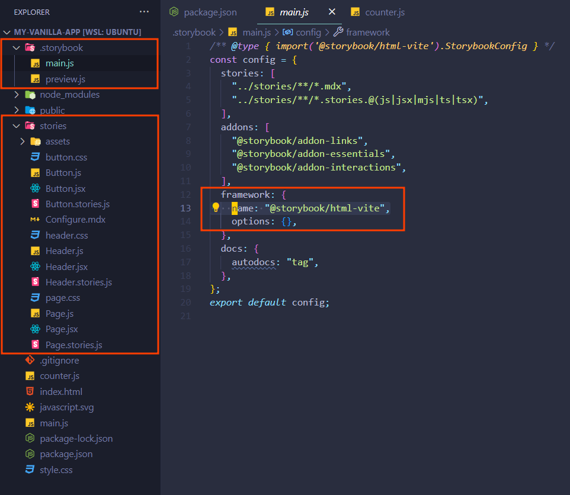

## Writing a Story for The Vanilla Vite Component

Lets create out first Vanilla JavaScript HTML story. We will take the `/counter.js` component, and write a story with the following features:

1. Add custom argument for the Counter Button's background color.
2. Add custom argument for the Counter Button's label; initially set to "count".
3. Listen to click events coming from the button's DOM element.

```javascript
// stories/Counter.javascript.stories.js

// First we load the `withActions` decorator, so listen to DOM events
import { withActions } from "@storybook/addon-actions/decorator";

// Then we import the `setupCounter` function to initialize the Counter Button component
import { setupCounter } from "../counter.js";

export default {
  title: "Counter Vanilla JS",

  // Create a new `button` element and pass it to the `setupCounter` function
  render: (args) => setupCounter(document.createElement("button"), args),
  tags: ["autodocs"],

  // Ask Storybook to listen to the `click` event 
  parameters: {
    actions: {
      handles: ["click"],
    },
  },

  // Make sure `withActions` is used as a decorator, otherwise your click events will not show up
  decorators: [withActions],

  // Set the controls for `backgroundColor` and `label` 
  argTypes: {
    backgroundColor: { control: "color" },
    label: "Counter",
  },
};

// Don't forget to export a `Primary` view for your component, or nothing will render
export const Primary = {
  render: (args) => setupCounter(document.createElement("button"), args),
  args: {
    label: "Counter",
  },
};
```

Now run storybook from the CLI and load the story:

```bash
npm run storybook
```

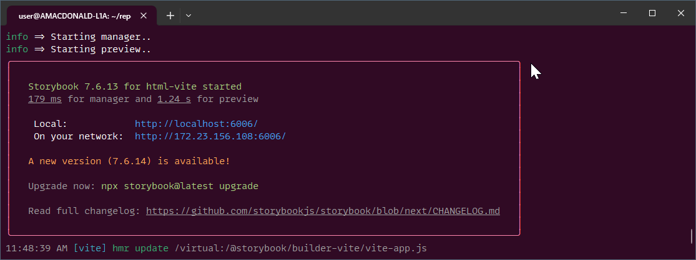

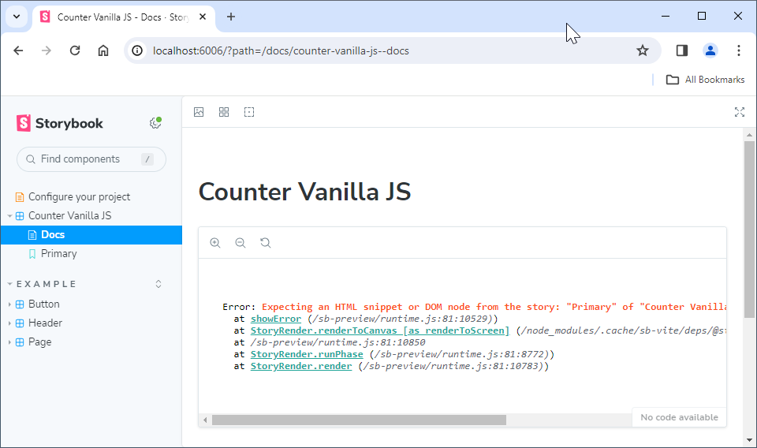

You will see the error: `Expecting an HTML snippet or DOM node from the story: "Primary" of "Counter Vanilla JS". - Did you forget to return the HTML snippet from the story?`

This is because we have not passed the element back to Storybook's render function. Let's update our component so that Storybook can find the DOM element.

```javascript
// counter.js
export function setupCounter(element) {
  let counter = 0
  const setCounter = (count) => {
    counter = count
    element.innerHTML = `count is ${counter}`
  }
  element.addEventListener('click', () => setCounter(counter + 1))
  setCounter(0)

  return element  // <--- RETURN DOM ELEMENT HERE!
}
```

Congratulations! Now your Vanilla JavaScript/HTML component loads and renders in Storybook. You may wonder, "Why does it look different?"

It looks different because Vite was setting styles in the `index.html` file for the button. _Adding styles to the component is beyond the scope of this tutorial._


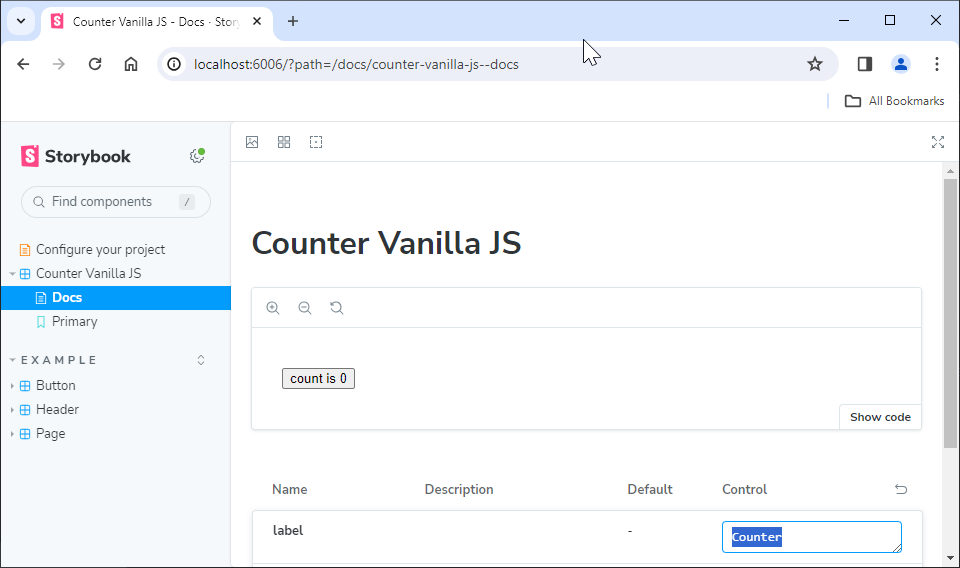

But notice above, that the button says "count" and does not pick up the label "Counter". We will update to the `counter.js` component to reflect the arguments sent to it from Storybook.

```javascript
// counter.js

// First we add the `args` parameter to the setup function
export function setupCounter(element, args) {

  // Then we  pull the label and the backgroundColor using
  // safe defaults for when the component is used outside
  // of Storybook.
  const label = args?.label || "count";
  const backgroundColor = args?.backgroundColor || "#EEEEEE";

  let counter = 0;

  const setCounter = (count) => {
    counter = count;
    
    // Here we reference the `label` arg
    element.innerHTML = `${label} is ${counter}`;
  };

  element.addEventListener("click", () => setCounter(counter + 1));

  // And finally, we apply the backgroundColor
  element.style.backgroundColor = backgroundColor;

  setCounter(0);

  return element;
}
```

Storybook should pick up the changes and "hot-swap" the updated component into view when you save the `counter.js` file.

You can now see that the component's `label` and `backgroundColor` are dynamically adjustable from within Storybook.

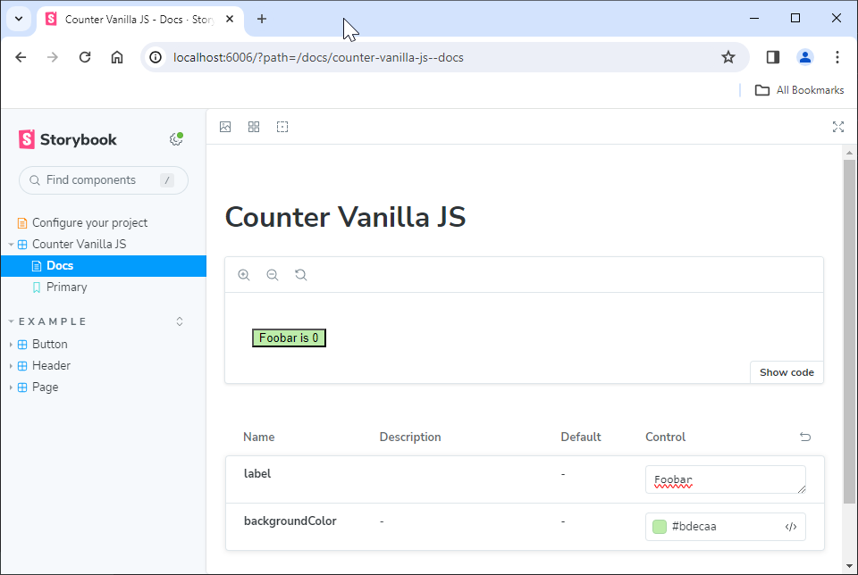

## Adding a Web Component to Storybook

Lets add a Vanilla Web Component to our Storybook.

Web Components are a little tricker, because the web browser will only let you register the name of a component once! And there is no way to unregister a web component.

So first, we will create a Web Component Setup function that we can call from our component stories. This function will use a randomized name and a class extension to register our web component descretely.

```javascript
// stories/web-component-setup.js

// Into our Web Component Setup we pass the component's
// class definition, as well as the Storybook arguments.
export default function SetupWebComponent (ComponentClass, args) {

  // First we generate a random UUID for our component name
  const uuid = crypto.randomUUID();
  const componentName = `web-component-${uuid}`;

  // Then we define the component with it's randomized name
  window.customElements.define(
    componentName,

    // We extend the component's class definition every time we 
    // register the component. This to avoids the warning:
    // "Failed to execute 'define' 'CustomElementRegistry':
    // this constructor has already been used with this registry."
    class WebComponent extends ComponentClass {}
  );

  // Now we create a DOM element with our Web Component
  const component = document.createElement(componentName);

  // We apply all the Storybook args to it's DOM Element:
  for (const [prop, val] of Object.entries(args)) {
    component.setAttribute(prop, val);
  }

  console.log(componentName);

  // Finally, we return the component's DOM Element.
  return component;
}
```

Now let's create a Web Component based on the original `counter.js` file.

```javascript
// counter.web-component.js

class MyCounter extends HTMLElement {

  // Observe the Storybook arguments as web component attributes
  static get observedAttributes() {
    return ["label", "color"];
  }

  // Update the values when the attributes change
  attributeChangedCallback(name, oldValue, newValue) {
    if (this[name] !== oldValue) {
      console.log(`MyCounter: set attribute "${name}" to: ${newValue}`);

      this[name] = newValue;
      this.update();
    }
  }

  // Set default values for the component
  count = 0;
  label = "Count";
  color = "#DFD";

  // A function to render the inside of the button
  innerText = () => `${this.label} = ${this.count}`;

  constructor() {
    super();
    const shadow = this.attachShadow({ mode: "closed" });

    // Render the `count` template into the Button element of the component
    const template = document.createElement("template");
    template.innerHTML = /* HTML */ `<button>${this.innerText()}</button>`;
    const node = template.content.cloneNode(true);
    shadow.append(node);

    // Get the button element...
    this.button = shadow.querySelector("button");

    // Set it's background color
    this.button.style.backgroundColor = this.color;

    // Increment the count when user clicks the button
    this.button.addEventListener("click", () => {
      this.count += 1;

      // Call update() to re-render Button's innerText w/ new `count` & `label`
      this.update();

      // IMPORTANT: You MUST dispatch events to the outer element of your
      // web component, in order for Storybook to pick up the click event.
      this.dispatchEvent(new CustomEvent("click", { composed: true }));
    });
  }

  // Update the Button in the web component with the latest values
  // every time the Storybook argument change.
  update() {
    this.button.innerText = this.innerText();
    this.button.style.backgroundColor = this.color;
  }
}

// We register the component in the page for normal (non-Storybook) use...
try {
  window.customElements.define('my-counter', MyCounter);
} catch (error) {
  console.warn(error)
}

// ...But we export the class as default. This allows us to hand-off the
// instantiation of our component under it's randomized name.
export default MyCounter;
```

You might think to register your component at the end of the script, as seen in this next line of JavaScript:

```javascript
window.customElements.define('my-counter', MyCounter);
```

### Custom Element Registry Error

But this causes issues with Storybook, which will try to re-register the component every time you make a change to either the story, or the component itself.

It would be nice if Storybook could be configured to side-step this error.

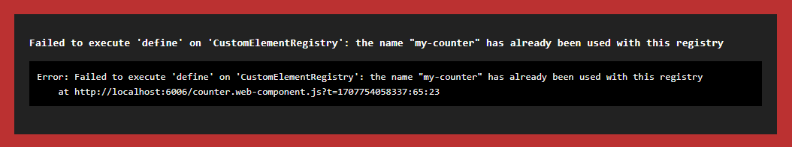

The same Custom Element Registry error as viewed from the console:

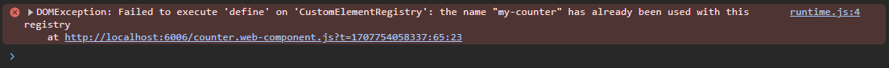

We can add `try-catch` blocks around our registry line of code to bypass this error for now.

```javascript
try {
  window.customElements.define('my-counter', MyCounter);
} catch (error) {
  console.warn(error)
}
```

With the `try-catch` blocks in place, we can see that our `error` turns into a `warning`. Notes that the first time the `counter.js` Web Component is registred by Storybook, it's component name is `web-component-aba8d235-9383-4742-9ae9-a1703d2e5173` and after making an update to the story or the component itself, it's new component name is `web-component-5a547184-25de-4336-81d2-18bb4c4bcde3`.

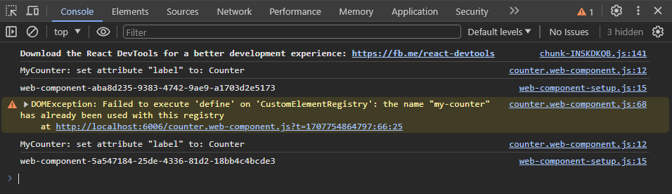

### Putting it All Togther

Now let's put-it-all-together inside a story file and test things out in Storybook's UI.

```javascript
// stories/Counter.web-component.stories.js

// We load the events/actions decorator, as before.
import { withActions } from "@storybook/addon-actions/decorator";

// We load our web-component-setup function we created above.
import WebComponentSetup from "./web-component-setup";

// Then we import our new Counter file: counter.web-component.js
import MyCounter from "../counter.web-component.js";

export default {
  title: "Counter Web Component",

  // Now when we want Storybook to initialize our component, we just
  // make a call to WebComponentSetup, which is the default export
  // of our: `/stores/web-component-setup.js` file.
  render: (args) => WebComponentSetup(MyCounter, args),
  
  tags: ["autodocs"],

  // Mae sure to listen to the dispatched click events
  parameters: {
    actions: {
      handles: ["click"],
    },
  },

  // And don't forget the `withActions` decorator!
  decorators: [withActions],

  // Export the arguments we want to control in our Web Component. 
  argTypes: {
    color: { control: "color" },
    label: "Counter",
  },
};

// Finally, export the `Primary` view, otherwise our Story would be blank.
export const Primary = {
  render: (args) => WebComponentSetup(MyCounter, args),
  args: {
    label: "Counter",
  },
};
```

As you can see, our vanilla Web Component story is now loading in Storybook. We can update the `color` and the `label` on the button. 

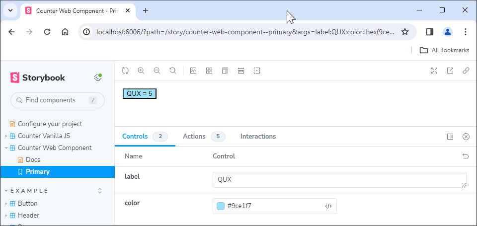

The click events are also dispatched back to the Web Component's DOM Element. These are visible from the `Actions` tab.

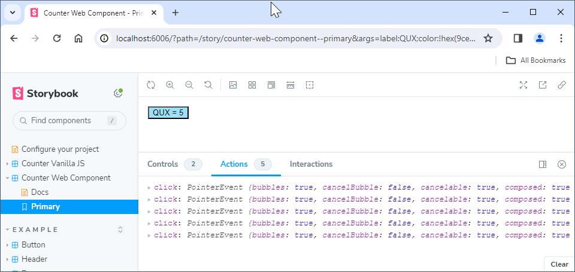

## Conclusion

So it is possible to use Vanilla JavaScript and Vanilla Web Components with Storybook, after a little setup. I had looked for a solution a few times but was confused by the vanilla-option being name `html` in both Storybook and Vite; not to mention Storybook naming the Lit Framework as `web-components` - as if the only way to do Web Components is Lit.

My hope is that people will read this tutorial and learn that it's actually quite easy to set up Vanilla JavaScript and Web Components in Storybook with Vite!